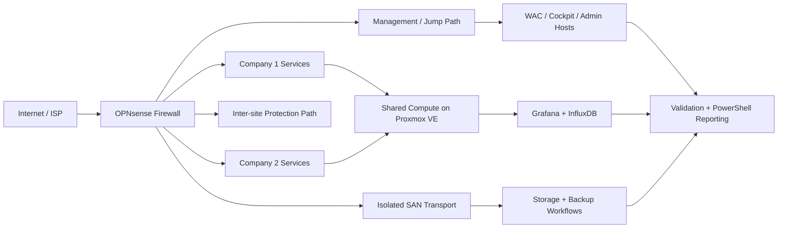

# Enterprise Infrastructure Capstone Showcase

This repository is a sanitized, public-safe distillation of my Enterprise Infrastructure Capstone, including the infrastructure, operations, and handover logic behind the delivered environment.

It is intentionally structured to be readable by a recruiter in a few minutes and useful to a technical reviewer who wants to see how I think about service boundaries, validation, and operational support.

## What This Repository Demonstrates
- Multi-tenant infrastructure thinking instead of isolated single-service demos
- A support-oriented view of systems administration, not just build steps
- Clear documentation habits: architecture, runbooks, validation, and triage
- Lightweight automation through a PowerShell health-report script
- Public sharing discipline through sanitized examples and non-sensitive artifacts

## Environment Snapshot
- `2` tenant service stacks with different platform preferences
- `9` segmented VLANs and a bounded management path
- `12` documented workloads across shared infrastructure
- `10` local systems covered by documented backup scope
- `7` offsite backup-copy jobs routed through a site-to-site protection path
- Shared OPNsense, Proxmox VE, storage, monitoring, and Veeam workflows

## Operational Priorities
These priorities come directly from the integrated handover logic that informed this public version:

1. Preserve tenant boundaries first.
2. Preserve approved administrative and MSP entry paths second.
3. Treat storage and backup continuity as platform-level dependencies, not isolated service tasks.

## Technical Focus
- OPNsense for segmentation, policy enforcement, remote-access thinking, and bounded exposure
- Proxmox VE for shared compute and workload hosting
- Windows Server and Samba AD concepts for tenant-separated identity, DNS, DHCP, and admin paths
- Windows iSCSI, SMB-backed protection, and Veeam workflows for storage and recovery thinking
- Grafana, InfluxDB, Windows Admin Center, and Cockpit for operational visibility and browser-based administration
- PowerShell and documentation-backed automation for repeatable checks

## Architecture Snapshot


## Repository Layout
```text
.
|-- assets/
|-- config/
|-- docs/
|   |-- architecture.md
|   |-- operations-runbook.md
|   |-- triage-guide.md
|   `-- validation-checklist.md
|-- reports/
|-- scripts/
|-- .gitignore
`-- README.md
```

## Key Files
- [docs/architecture.md](docs/architecture.md): high-level design notes, service planes, and the public-safe operating model
- [docs/operations-runbook.md](docs/operations-runbook.md): support priorities, service dependencies, and maintenance cadence
- [docs/triage-guide.md](docs/triage-guide.md): fast first checks for common failure symptoms
- [docs/validation-checklist.md](docs/validation-checklist.md): daily, weekly, monthly, and post-change validation habits
- [config/sample-endpoints.json](config/sample-endpoints.json): categorized endpoint list for the health-report script
- [scripts/backup-health-check.ps1](scripts/backup-health-check.ps1): generates a Markdown report from TCP and HTTP endpoint checks

## Public Sharing Rules
- No real credentials
- No production secrets or VPN configuration
- No sensitive internal hostnames, usernames, or private operational data
- No screenshots that expose unsafe implementation details
- Public examples should show design intent, evidence quality, and supportability

## Related Links
- Portfolio site: https://huangstephen3.github.io
- LinkedIn: https://www.linkedin.com/in/yiqinhuang2025
