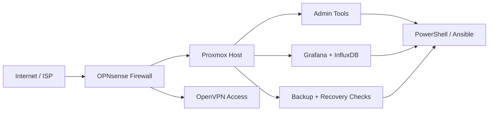

# Homelab Infrastructure Showcase

This repository is a sanitized showcase of the Windows, Linux, networking, monitoring, and backup concepts I have been practicing through coursework and home lab work.

It is designed to be recruiter-friendly at the top level and technically useful if someone wants to look deeper.

## Why This Repo Exists
- Show how I think about infrastructure, not just what tools I can name
- Present my home lab and capstone work in a way that is safe to share publicly
- Demonstrate documentation, validation, and light automation habits

## Technical Focus
- Proxmox VE and virtualization concepts
- OPNsense segmentation, NAT, and VPN-oriented thinking
- Windows Server and Samba AD administration concepts
- Monitoring with Grafana and InfluxDB
- Backup validation and operational health checks
- PowerShell and Ansible for repeatable tasks

## Project Highlights
- Built around the same systems-and-support direction as my one-page resume and portfolio site
- Includes a reusable PowerShell health-check script for endpoint and service validation
- Keeps diagrams and examples sanitized while still showing real operational structure

## Architecture Snapshot


## Repository Layout
```text
.
|-- assets/
|-- config/
|-- docs/
|-- reports/
|-- scripts/
|-- .gitignore
`-- README.md
```

## Key Files
- [docs/architecture.md](docs/architecture.md): high-level design notes and service responsibilities
- [docs/validation-checklist.md](docs/validation-checklist.md): repeatable checks for monitoring, backup, and admin paths
- [config/sample-endpoints.json](config/sample-endpoints.json): sanitized endpoint list for the health-check script
- [scripts/backup-health-check.ps1](scripts/backup-health-check.ps1): generates a Markdown status report from endpoint checks

## Public Sharing Rules
- No real credentials
- No secret VPN configuration
- No sensitive internal hostnames
- No live production data

## Related Links
- Portfolio site: https://huangstephen3.github.io
- LinkedIn: https://www.linkedin.com/in/yiqinhuang2025
