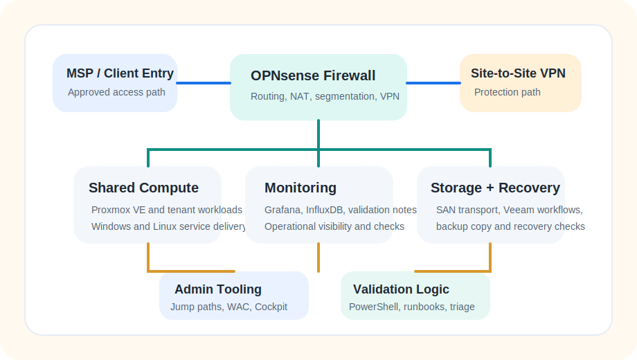
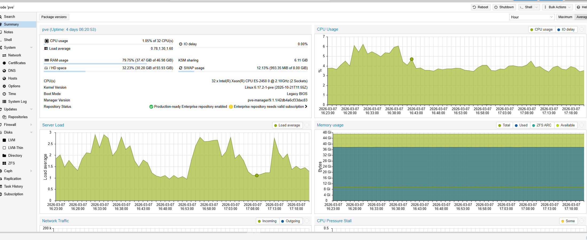
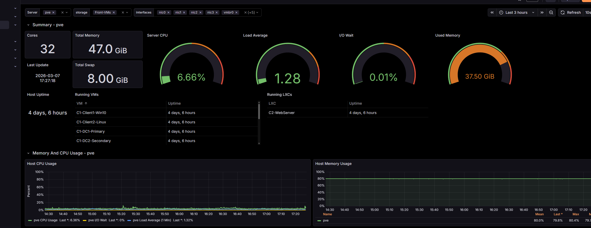
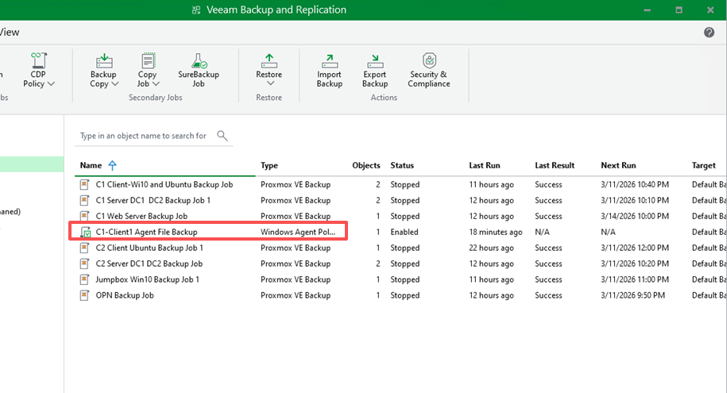

# Enterprise Infrastructure Capstone Showcase

Public-safe highlight of the original `Site 1` deliverables from my Enterprise Infrastructure Capstone. In the course handover, `Site 1` represented the simulated `private-cloud` primary environment, and I independently designed, implemented, and documented that portion of the project. This repo distills that work into a recruiter-friendly architecture snapshot, evidence gallery, operations notes, and lightweight automation artifacts.

[Portfolio](https://huangstephen3.github.io/) | [Project Scope](docs/project-scope.md) | [LinkedIn](https://www.linkedin.com/in/yiqinhuang2025)

## Site 1 At a Glance

| Area | Details |
| --- | --- |
| Role | Simulated `private-cloud` primary environment with shared compute, tenant-separated services, bounded administrative access, and backup workflows |
| Platform | OPNsense, Proxmox VE, Windows Server, Veeam, Grafana, Windows Admin Center, Cockpit |
| Scale | `2` tenant stacks, `9` VLANs, `12` workloads, `10` protected systems, `7` offsite copy jobs |
| Repo goal | Show the strongest parts of the project quickly, without making a reviewer read the entire handover document |

## Why This Version Exists

- The original project handover is much longer and mixes build steps, screenshots, and integrated cross-site context.
- This public repo keeps the fastest high-signal material: architecture, contribution, operational priorities, evidence, and supporting automation.
- The simulated `public-cloud` secondary environment still appears where it explains VPN, offsite-copy, and recovery flow, but the showcase emphasis stays on `Site 1`.

## What I Built on Site 1

- Independently built and documented the simulated `private-cloud` primary environment around shared Proxmox compute, segmented tenant services, and bounded administrative paths.
- Structured backup and offsite-copy workflows so recovery planning was part of the platform design, not an afterthought.
- Produced monitoring and administration surfaces that made the environment supportable after handover.
- Turned a large course handover into a public-safe project showcase that still demonstrates architecture, validation thinking, and operational support habits.

## Evidence Gallery

Selected screenshots below were extracted from the full handover and trimmed for public-safe sharing. I chose the screenshots that explain `Site 1` fastest instead of uploading the full `.docx` as the main artifact.

<table>
  <tr>
    <td width="50%" valign="top">
      
      <strong>Architecture overview</strong> 
      Simplified view of the simulated private-cloud primary environment, including segmentation, shared compute, monitoring, and the inter-site protection path.
    </td>
    <td width="50%" valign="top">
      
      <strong>Shared compute on Proxmox VE</strong> 
      Capacity and utilization snapshot used to document the virtualization layer that hosted the primary environment.
    </td>
  </tr>
  <tr>
    <td width="50%" valign="top">
      
      <strong>Operational visibility</strong> 
      Grafana dashboard showing host health and workload monitoring for the Site 1 platform.
    </td>
    <td width="50%" valign="top">
      
      <strong>Backup and recovery readiness</strong> 
      Veeam job view used to document protected workloads and recovery-oriented operational checks.
    </td>
  </tr>
</table>

## Operational Priorities

1. Preserve tenant boundaries first.
2. Preserve approved administrative and MSP entry paths second.
3. Treat storage and backup continuity as platform-level dependencies.

## Supporting Automation

These scripts are supporting artifacts. They show how I translated recurring checks and exported validation evidence into reviewer-friendly outputs, but they are not presented as a promise that the original lab will stay online forever.

- [scripts/backup-health-check.ps1](scripts/backup-health-check.ps1): reads a categorized endpoint list and generates a Markdown health report from TCP and HTTP checks.
- [scripts/publish-validation-archive.ps1](scripts/publish-validation-archive.ps1): converts exported validation summaries into sanitized Markdown and JSON evidence for GitHub or portfolio use.
- [config/sample-endpoints.json](config/sample-endpoints.json): public-safe sample inventory that drives the health-report script.

## Reviewer Shortcuts

- [docs/project-scope.md](docs/project-scope.md): maps the original course scope to the public-safe version of this repo
- [docs/architecture.md](docs/architecture.md): service planes, infrastructure roles, and operating model
- [docs/operations-runbook.md](docs/operations-runbook.md): maintenance rhythm and platform support priorities
- [docs/triage-guide.md](docs/triage-guide.md): first checks for common infrastructure symptoms
- [docs/validation-checklist.md](docs/validation-checklist.md): daily, weekly, monthly, and post-change validation habits
- [docs/validation-toolkit-archive.md](docs/validation-toolkit-archive.md): how the original live validation toolkit is preserved after the lab closes on April 17, 2026

Public sharing rules

- No real credentials
- No production secrets or VPN configuration
- No unsafe internal implementation details
- No screenshots chosen only because they are numerous; public examples should show design intent, evidence quality, and supportability

